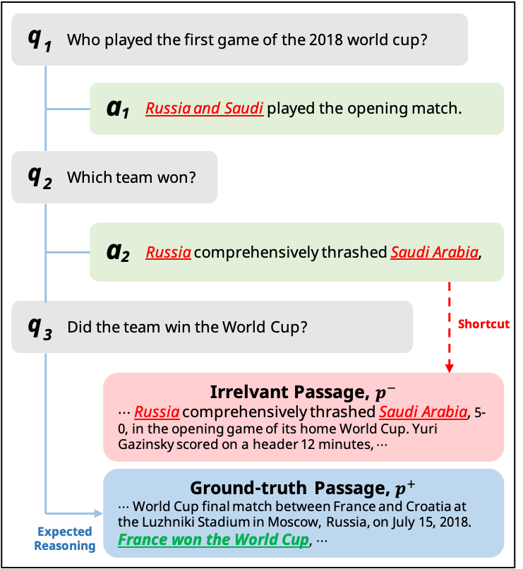

# Retrieval Shortcut in Conversational Search

Official implementation of "[Saving Dense Retriever from Shortcut Dependency in Conversational Search](https://arxiv.org/abs/2202.07280)". <br>

> **[Sungdong Kim<sup>1,2</sup>](https://scholar.google.com/citations?user=xKrSnDoAAAAJ&hl=en)**, [Gangwoo Kim<sup>3</sup>](https://scholar.google.com/citations?user=TmWGEFgAAAAJ&hl=en)<br>
> NAVER AI LAB<sup>1</sup>, KAIST AI<sup>2</sup>, Korea University<sup>3</sup> <br>
> In EMNLP 2022.


<p align="center">
    
</p>

> **Abstract** Conversational search (CS) needs a holistic understanding of conversational inputs to retrieve relevant passages. In this paper, we demonstrate the existence of a retrieval shortcut in CS, which causes models to retrieve passages solely relying on partial history while disregarding the latest question. With in-depth analysis, we first show that naively trained dense retrievers heavily exploit the shortcut and hence perform poorly when asked to answer history-independent questions. To build more robust models against shortcut dependency, we explore various hard negative mining strategies. Experimental results show that training with the model-based hard negatives (Xiong et al., 2020) effectively mitigates the dependency on the shortcut, significantly improving dense retrievers on recent CS benchmarks. In particular, our retriever outperforms the previous state-of-the-art model by 11.0 in Recall@10 on QReCC (Anantha et al., 2021)


## Environments

```
python >= 3.8
torch==1.9.0
transformers==4.8.2
faiss-cpu==1.7.1
faiss-gpu==1.7.1
```

Please see `requirements.txt` for more details. <br>
Run `pip3 install -r requirements.txt` to setup the environments.


## 1. Dataset Preparation

We split [original train dataset](https://zenodo.org/record/5115890) of qrecc into our own train and dev set. <br>
In addition to the split, we provide sampled subdocuments for efficient development. <br>
The files can be found in `assets` directiory. <br> <br>

Set environment variables to download and preprocess a specific task (TASK=qrecc|orconvqa). <br>

```
export TASK=$TASK
export DATA_PATH=dataset
export OUTPUT_PATH=preprocessed
```

#### 1) Download dataset

Just run this script to download dataset.
`$ ./get_dataset.sh`

#### 2) Preprocessing dataset

First, build a pyserini index to perform BM25 search and preprocessing.
  - It includes passage dump file preprocessing procedure as well. Please see `build_pyserini.py` for the details.

`$ python3 build_pyserini.py --task $TASK --data_path $DATA_PATH/$TASK --output_path $OUTPUT_PATH/$TASK`
  
Then, run the below script to preprocess each dataset.

**orconvqa**

```
python3 data_preprocessing.py \
  --task $TASK \
  --data_path $DATA_PATH \
  --output_path $OUTPUT_PATH \
  --max_query_length 128 \
  --max_passage_length 384 \
  --pyserini_index_path $DATA_PATH/$TASK/pyserini_index \
  --dev_collection_path $DATA_PATH/$TASK/dev_blocks.jsonl \
  --test_collection_path $DATA_PATH/$TASK/all_blocks.jsonl \
  --use_only_queries \
  --retain_first_question
```

**qrecc**

```
python3 data_preprocessing.py \
  --task $TASK \
  --data_path $DATA_PATH \
  --output_path $OUTPUT_PATH \
  --max_query_length 128 \
  --max_passage_length 384 \
  --pyserini_index_path $DATA_PATH/$TASK/pyserini_index \
  --dev_collection_path $DATA_PATH/$TASK/dev_blocks.jsonl \
  --test_collection_path $DATA_PATH/$TASK/collection-paragraph/*/*.jsonl \
  --retrain_frist_question
```

## 2. Training DPR Retriever

### Training vanilla DPR

Set corresponding environment variables first. <br>
For $TRAIN_DATA, please set `train.json` for orconvqa or `train_filtered.json` for qrecc (only using examples including gt passages) <br>
Or you can define another dataset containing hard negatives after mining them. e.g., `train_negs.json` or `train_filtered_negs.json` <br>

```
export DATA_PATH=preprocessed
export OUTPUT_PATH=outputs
export N_GPU=$N_GPU
export TRAIN_DATA=$TRAIN_DATA
```

```
python3 ddp_launcher.py \
  --data_path $DATA_PATH \
  --output_path $OUTPUT_PATH \
  --task $TASK \
  --model_name_or_path facebook/dpr-question_encoder-single-nq-base \
  --train_data $TRAIN_DATA \
  --dev_data dev.json \
  --test_data test.json \
  --train_batch_size 128 \
  --eval_batch_size 256 \
  --num_train_epochs 10 \
  --index_batch_size 512 \
  --learning_rate 3e-5 \
  --weight_decay 0.1 \
  --num_warmup_steps 0 \
  --n_hard_negative 0 \
  --top_k 100 \
  --max_buffer_size 1574824 \
  --do_predict
```

If you include "--do_predict" argument, resulting outputs of the evaluation will be located in $OUTPUT_PATH. <br>
(WANRNING!) The indexing and retrieval for the inference take much time according to its whole passage collection size. <br>
In other word, QReCC, which has about 50M passages, requires lots of time and memory consumptions. <br>
We will add ANN search to increase the retrieval speed in the very soon.

* index_(dev|test).faiss : FAISS index file. It requires 30-160GB of storage.
* (dev|test)_eval_result.json: evaluation result including MRR and Recall@k
* (dev|test)_eval_scores.json: top-k relevance scores for each query
* (dev|test)_eval_incices.json: top-k indices for each query

In the case of QReCC, the overall result could be evaluated based on question types. <br>
For this, please run the below script.

`$ python3 eval_breakdown.py --result_data_file $OUTPUT_PATH/test_eval_scores.json --data_path $DATA_PATH`

```
trec 371
{'MRR': 0.32469379627601447, 'Recall@5': 0.4474393530997305, 'Recall@10': 0.555256064690027, 'Recall@20': 0.6531895777178797, 'Recall@100': 0.8045822102425876}

quac 6396
{'MRR': 0.5424993382858436, 'Recall@5': 0.6970137137211299, 'Recall@10': 0.7789605586634041, 'Recall@20': 0.8246712239580937, 'Recall@100': 0.8872222779071794}

nq 1442
{'MRR': 0.5268851536713797, 'Recall@5': 0.6412327583120463, 'Recall@10': 0.7337462549009012, 'Recall@20': 0.7976587435013233, 'Recall@100': 0.8827564813313773}

no-switch 279
{'MRR': 0.7206635174177008, 'Recall@5': 0.8315113500597372, 'Recall@10': 0.8806650736758264, 'Recall@20': 0.9111509358821187, 'Recall@100': 0.9414177618478694}

switch 573
{'MRR': 0.3969942310926863, 'Recall@5': 0.52380653959188, 'Recall@10': 0.629972084343812, 'Recall@20': 0.7156843553963973, 'Recall@100': 0.8406293425403373}

first 267
{'MRR': 0.4818849831007729, 'Recall@5': 0.5770911360799, 'Recall@10': 0.7091136079900124, 'Recall@20': 0.7649812734082397, 'Recall@100': 0.8707865168539326}

all 8209
{'MRR': 0.5299129684113517, 'Recall@5': 0.6759358448588522, 'Recall@10': 0.7609080074038533, 'Recall@20': 0.8121761956265329, 'Recall@100': 0.8827029523174765}
```


### Mining Hard Negative

It outputs `$split_negs.json` and you should specify it for `$TRAIN_DATA` of retriever training.

**Model-Negs**

Model-based hard negative mining. It utilizes already finetuned vanilla DPR from the first stage. <br>

```
export DATA_PATH=preprocessed
export OUTPUT_PATH=$OUTPUT_PATH # checkpoint of already finetuned vanilla DPR

python3 build_dense_negatives.py \
  --task $TASK
  --data_path $DATA_PATH \
  --split train \
  --output_path $DATA_PATH \
  --model_name_or_path $OUTPUT_PATH \
  --index_batch_size 1024 \
  --top_k 100 \
  --iteration 1 \
```

The resulting file will be `$OUTPUT_PATH/train_negs.json`.

**BM25-Negs**

```
export DATA_PATH=dataset
export OUTPUT_PATH=preprocessed

python3 build_bm25_negatives.py \
  --task $TASK \
  --split train \
  --read_by all \
  --raw_data_path $DATA_PATH \
  --preprocessed_data_path $OUTPUT_PATH \
  --pyserini_index_path $OUTPUT_PATH/$TASK/pyserini_index \
  --top_k 100
```

The resulting file will be `$OUTPUT_PATH/$TASK/train_bm25_negs.json`.

**CQR-Negs**

First, preprocess the corresponding dataset by using `--use_rewrite_only` argument.

```
export DATA_PATH=dataset
export OUTPUT_PATH=preprocessed

python3 data_preprocessing.py \
  --task $TASK \
  --suffix rewrite \
  --data_path $DATA_PATH \
  --output_path $OUTPUT_PATH \
  --max_query_length 128 \
  --max_passage_length 384 \
  --pyserini_index_path $DATA_PATH/$TASK/pyserini_index \
  --use_rewrite_only
```

Then,

```
export DATA_PATH=preprocessed
export OUTPUT_PATH=rewrite_negative

python3 build_dense_negatives.py \
  --task $TASK
  --data_path $DATA_PATH \
  --split train_rewrite \
  --output_path $DATA_PATH \
  --model_name_or_path $OUTPUT_PATH \
  --index_batch_size 1024 \
  --top_k 100 \
  --iteration 1 \
```

The resulting file will be `$OUTPUT_PATH/train_rewrite_negs.json`.

## Playing with pretrained model from Huggingface Models

```python
import json
import torch
from transformers import DPRContextEncoder, DPRQuestionEncoder, AutoTokenizer
from utils.conv_tokenizer import ConvTokenizer

q_encoder = DPRQuestionEncoder.from_pretrained("dsksd/dpr-question_encoder-single-qrecc-model-base")
ctx_encoder = DPRContextEncoder.from_pretrained("dsksd/dpr-ctx_encoder-single-qrecc-model-base")

tokenizer = AutoTokenizer.from_pretrained("dsksd/dpr-question_encoder-single-qrecc-model-base")
conv_tokenizer = ConvTokenizer(tokenizer)

conversation = [
    "Who played the first game of the 2018 world cup?",
    "Russia and Saudi played the opening match.",
    "Which team won?"
]

passages = json.load(open("assets/example_passages.json", "r", encoding="utf-8"))

q_inputs = conv_tokenizer(
      [conversation],
      max_length=128,
      padding="max_length", # max_length or longest
      truncation=True, # no other option here, (truncation from left-side)
      retain_first_utter=True, # it retains first utterance when True
      turn_delim_token=tokenizer.sep_token, # add delimiter token between utterance
      return_tensors="pt"
)

ctx_inputs = tokenizer(passages, max_length=384, padding="max_length", truncation=True, return_tensors="pt")

with torch.no_grad():
    q_vec = q_encoder(**q_inputs)
    ctx_vec = ctx_encoder(**ctx_inputs)
    
    score = torch.matmul(ctx_vec[0], q_vec[0].transpose(0, 1)).squeeze()
    _, idx = score.topk(3, 0)  # top-3

for i in idx:
    print(passages[i])

>>> how russia beat saudi arabia in the world cup opener - ... **2018 russia comprehensively thrashed saudi arabia**, 5 - 0, ...
```

## License

Licensed under [CC BY-NC 4.0](LICENSE)

```
CS-Shortcut
Copyright 2022-present NAVER Corp.
CC BY-NC-4.0 (https://creativecommons.org/licenses/by-nc/4.0/)
```

## Citation


```bibtex
@inproceedings{kim2022saving,
  title={Saving Dense Retriever from Shortcut Dependency in Conversational Search},
  author={Kim, Sungdong and Kim, Gangwoo},
  booktitle={EMNLP},
  year={2022}
}
```
